<h1 align="center">Patient No-Show Prediction</h1>

<p align="center">
  
  
  
  
  
</p>

<p align="center">
  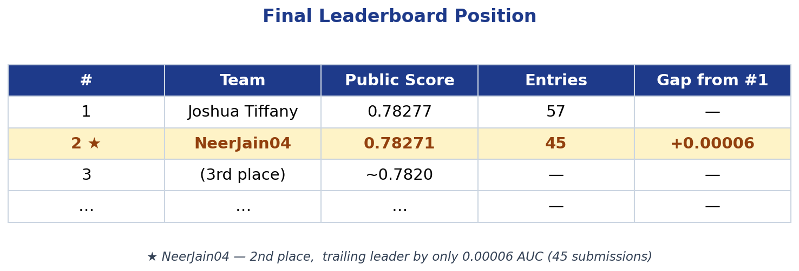
</p>

---

## Competition Overview

Predict whether a patient will miss their scheduled medical appointment (*no-show*) using appointment metadata and patient history. The evaluation metric is **ROC-AUC**.

| | |
|---|---|
| Dataset | 168,982 training rows · 20 categorical features |
| Target | `NO_SHOW_FLG` (binary: 1 = no-show) |
| Class balance | ~5% no-show (imbalanced) |
| Metric | ROC-AUC |

---

## Final Pipeline

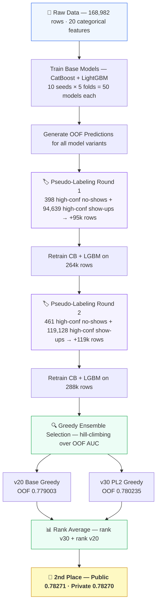

---

## Key Techniques

- **CatBoost with native categorical encoding** — all 20 features are categorical strings; CatBoost's ordered target encoding was the strongest single model (5-fold CV AUC 0.7736)
- **Multi-seed ensembling** — 10 seeds × 5-fold CV = 50 models per algorithm; seed averaging substantially reduces prediction variance
- **Pseudo-labeling (2 rounds)** — high-confidence test predictions added as extra training rows; biggest single LB jump of the competition (+0.00027 from v10 → v18)
- **Greedy ensemble selection** — hill-climbing over OOF AUC to find the optimal subset and weights across all saved OOF arrays (Caruana et al. 2004)
- **Rank averaging** — percentile-rank normalisation before blending removes calibration differences between models trained on different data distributions

---

## Experiment Timeline

| Version | Technique | Public AUC |
|---|---|---|
| v1 | CatBoost 5-fold CV baseline | 0.78056 |
| v2 | CatBoost multi-seed ensemble | 0.78166 |
| v8 | CatBoost + LightGBM blend, 10-seed × 5-fold | 0.78214 |
| v10 | CB lr=0.01, iter=3000 (slower convergence) | 0.78218 |
| v18 | Pseudo-labeling round 1 (+95k rows) | 0.78245 |
| v19 | Greedy ensemble selection | 0.78249 |
| v20 | Multi-start greedy ensemble | 0.78256 |
| v26 | Rank blend: rank(v23) + rank(v20) | 0.78268 |
| **v31** | **Rank blend: v30 greedy-pl2 + v20 base greedy** | **0.78271** ← final |

<p align="center">
  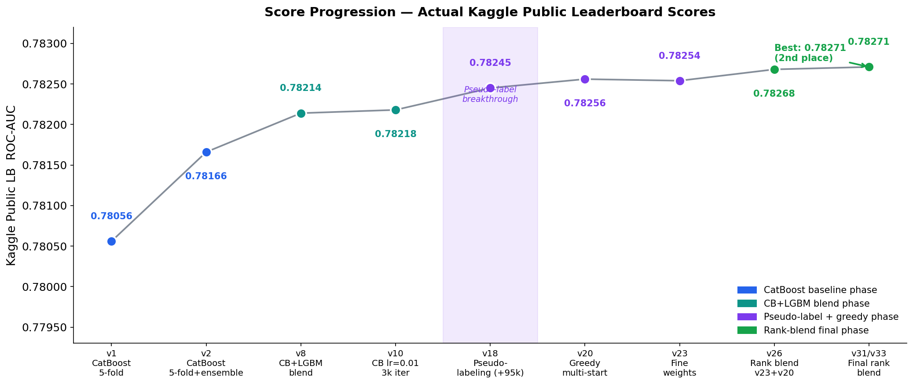
  <br/><em>Public LB score across all 45 submissions</em>
</p>

<p align="center">
  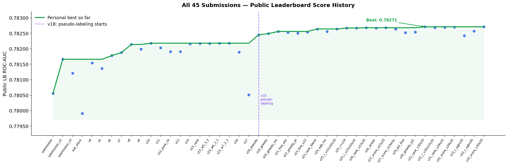
  <br/><em>All 45 submission scores plotted chronologically</em>
</p>

---

## What Didn't Work

These were explored and abandoned (baseline v10 = 0.78218):

| Technique | Version | Public AUC | Why |
|---|---|---|---|
| 7 interaction features | v16 | 0.78189 | CatBoost already captures interactions via ordered target encoding |
| Frequency encoding (primary) | v17 | 0.78051 | CatBoost's encoding already captures category frequency signal |
| Optuna-tuned LightGBM | v9 | 0.78199 | Tuned params underperformed defaults on this categorical-heavy dataset |
| Target-encoded LGBM blend | v11 | 0.78203 | Duplicates CatBoost's internal encoding; no diversity gain |
| 3-model stacking (CB+LGBM+XGB → LogReg) | submission_stack | 0.77991 | Meta-model overfits on small OOF; weaker than direct blend |

<p align="center">
  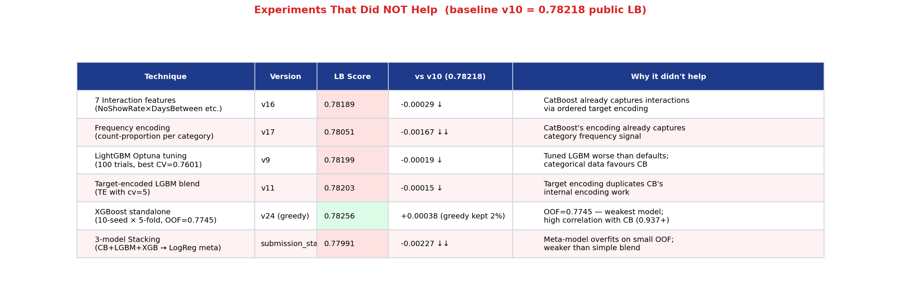
</p>

---

## Model Comparison (5-Fold CV on Training Data)

<p align="center">
  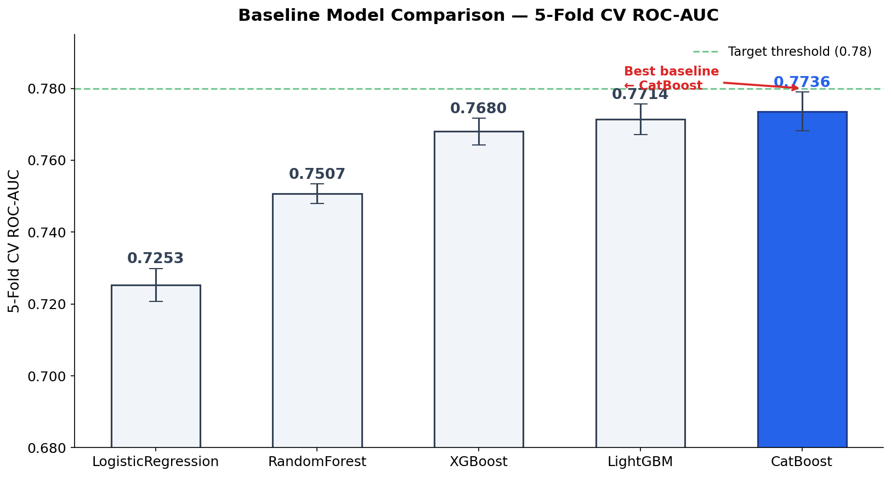
</p>

| Model | CV ROC-AUC | Notes |
|---|---|---|
| Logistic Regression | 0.7253 | Reference baseline |
| Random Forest | 0.7507 | |
| XGBoost | 0.7680 | |
| LightGBM | 0.7714 | |
| **CatBoost** | **0.7736** | Best single model — native categorical encoding |
| CatBoost (Optuna-tuned) | 0.7744 | Best params: depth=7, lr=0.034, iter=757, l2=7.49 |

<p align="center">
  <table>
    <tr>
      <td>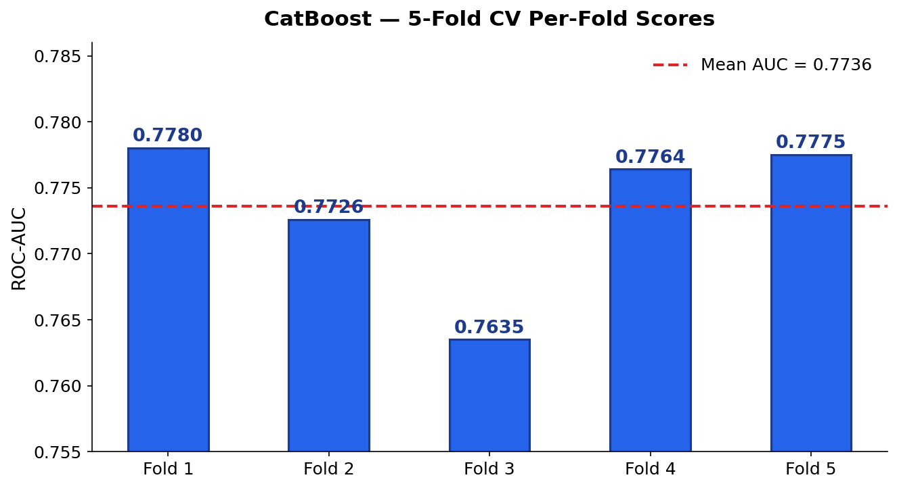</td>
      <td>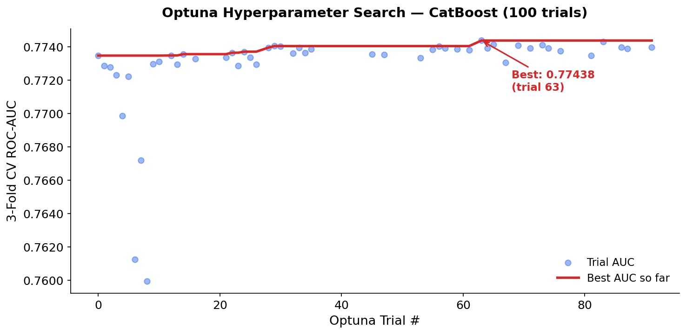</td>
    </tr>
    <tr>
      <td align="center"><em>CatBoost per-fold CV scores</em></td>
      <td align="center"><em>Optuna hyperparameter search convergence</em></td>
    </tr>
  </table>
</p>

---

## Feature Importance

<p align="center">
  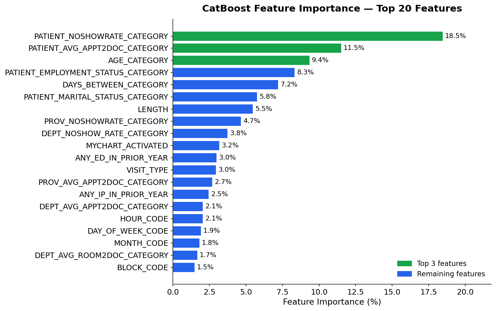
  <br/><em>Top features by CatBoost gain — patient no-show history is by far the strongest signal</em>
</p>

---

## Pseudo-Labeling

<p align="center">
  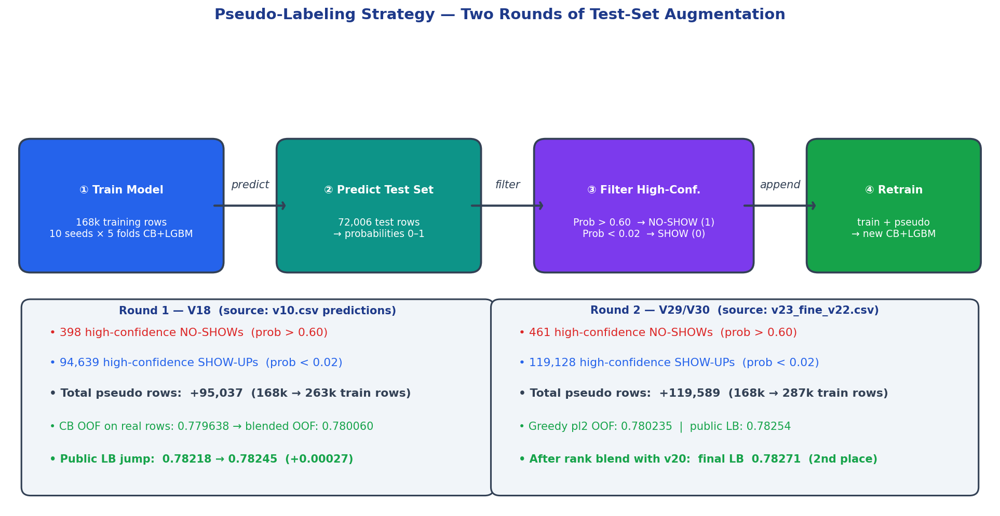
</p>

---

## Ensemble Architecture

<p align="center">
  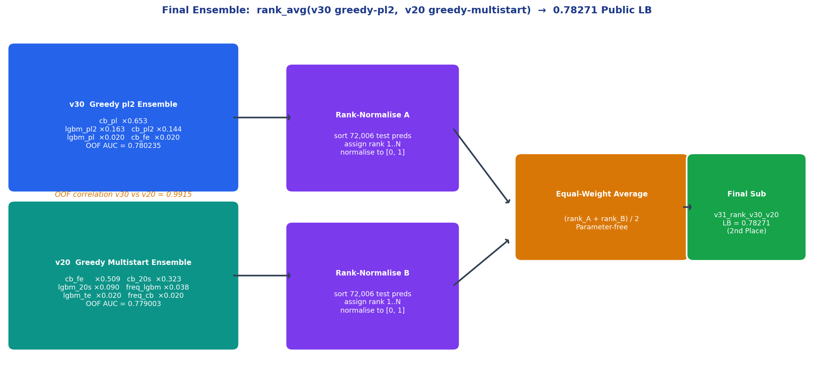
</p>

---

## Why Rank Averaging Works

<p align="center">
  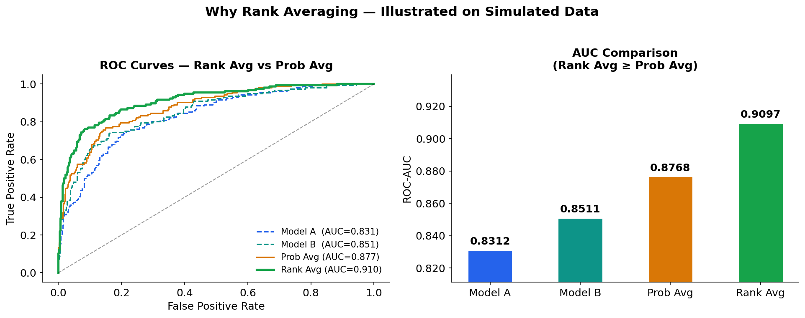
  <br/><em>Rank normalisation removes calibration differences between models trained on different data distributions</em>
</p>

---

## Repository Structure

```
osf-patient-no-show/
│
├── README.md
├── requirements.txt
├── .gitignore
├── generate_slides_images_v2.py   ← generates the 14 chart PNGs in slide_images/
│
├── experiments/                   ← per-version experiment write-ups
│   ├── v10_50model_ensemble.md
│   ├── v20_greedy_ensemble.md
│   ├── v22_pseudo_label_r1.md
│   ├── v26_rank_blend.md
│   ├── v29_pseudo_label_r2.md
│   └── v31_final_submission.md
│
└── osf_no_show_project/
    ├── main.py                    ← CLI entry point (controls the whole pipeline)
    ├── data_utils.py              ← data loading, feature splits, encoding helpers
    ├── train_baseline.py          ← CatBoost 5-fold CV baseline
    ├── tune.py                    ← Optuna hyperparameter search for CatBoost
    ├── tune_lgbm.py               ← Optuna hyperparameter search for LightGBM
    ├── blend.py                   ← CatBoost + LightGBM blend (10-seed × 5-fold)
    ├── blend_te_lgbm.py           ← target-encoded LightGBM variant
    ├── stack.py                   ← 3-model stacking (CB + LGBM + XGB → LogReg meta)
    ├── submission.py              ← Kaggle submission CSV generator
    ├── outputs/
    │   ├── model_results.csv      ← per-fold AUC for all 5 models
    │   ├── optuna_results.csv     ← all Optuna trial scores
    │   └── feature_importance/
    │       └── feature_importance.csv
    ├── results/                   ← saved OOF/test arrays and best hyperparameters
    │   ├── best_params.json       ← Optuna best CatBoost params (CV AUC 0.7744)
    │   └── best_lgbm_params.json  ← Optuna best LightGBM params
    ├── slide_images/              ← 14 presentation chart PNGs
    └── submissions/               ← 45 Kaggle submission CSVs
```

> **Data not included** — competition data is not redistributed per Kaggle rules. Download `train.csv`, `test.csv`, and `metaData.csv` from the competition page and place them in the repo root.

---

## Quickstart

```bash
# Install dependencies
pip install -r requirements.txt

# Train CatBoost baseline (5-fold CV)
python osf_no_show_project/main.py --baseline

# Run Optuna hyperparameter search for CatBoost (100 trials)
python osf_no_show_project/main.py --tune --trials 100

# Run 50-model CB+LGBM blend and generate submission
python osf_no_show_project/main.py --blend --output v10.csv

# Run 3-model stacking ensemble
python osf_no_show_project/main.py --stack --output stack.csv
```

---

## Key Findings

1. **Pseudo-labeling was the single biggest jump** — v10 (0.78218) → v18 (0.78245) = +0.00027 with strict thresholds (pos > 0.60, neg < 0.02). Looser thresholds hurt.
2. **Greedy ensemble selection consistently beat hand-tuned weights** — multi-start greedy (v20, 0.78256) outperformed every manually-tuned blend at the same model pool.
3. **Feature engineering hurt, not helped** — interaction features (v16: 0.78189) and frequency encoding (v17: 0.78051) both fell below the v10 baseline (0.78218). CatBoost's internal ordered target encoding already captures these signals.
4. **Optuna-tuned LightGBM underperformed defaults** — v9 tuned LGBM (0.78199) < v8 default LGBM (0.78214). Tuned params overfit to 3-fold CV; defaults generalised better to the LB.
5. **The private LB margin was 0.00015** — public gap was 0.00006. The rank blend of pseudo-label greedy (v30) + base greedy (v20) held 2nd on both public and private, confirming the ensemble was not leaderboard-overfit.

<p align="center">
  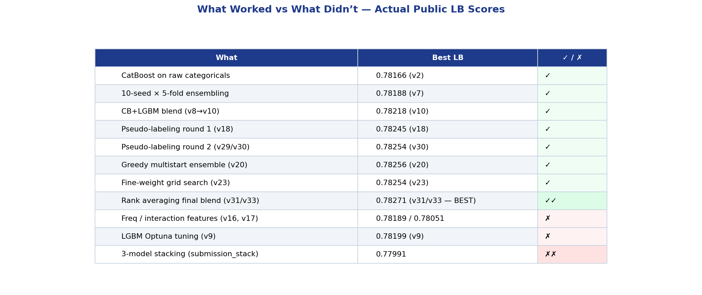
</p>

---

## Presentation Slides

<details>
<summary><strong>View all 14 presentation charts</strong></summary>
<br/>

<p align="center">
  <table>
    <tr>
      <td>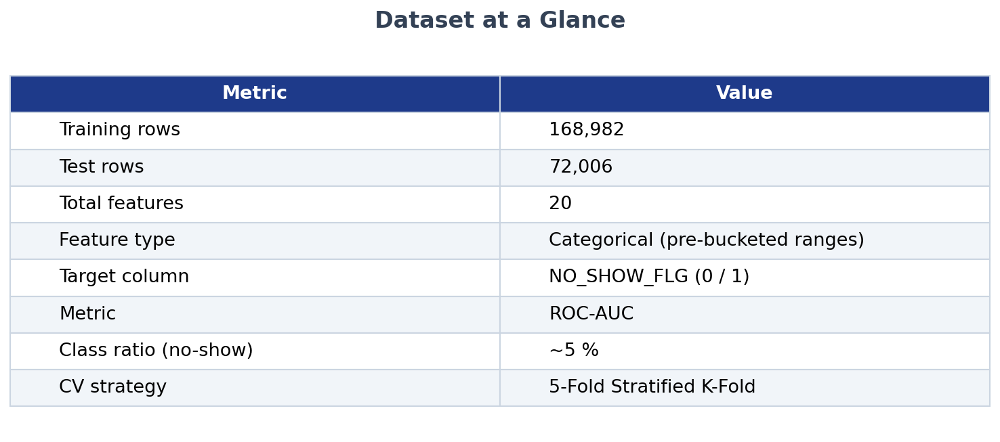</td>
      <td>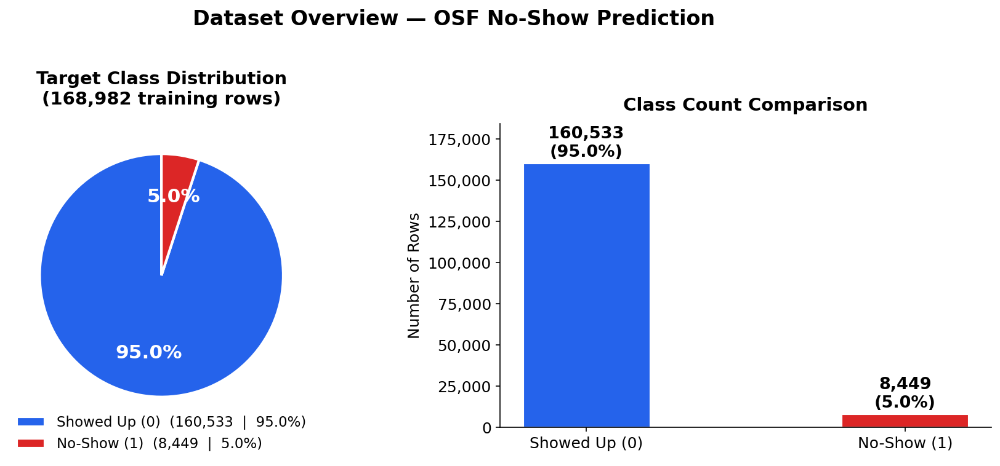</td>
    </tr>
    <tr>
      <td align="center"><em>Dataset overview</em></td>
      <td align="center"><em>Class distribution (~5% no-show)</em></td>
    </tr>
    <tr>
      <td></td>
      <td></td>
    </tr>
    <tr>
      <td align="center"><em>Model comparison</em></td>
      <td align="center"><em>CatBoost fold scores</em></td>
    </tr>
    <tr>
      <td></td>
      <td></td>
    </tr>
    <tr>
      <td align="center"><em>Optuna convergence</em></td>
      <td align="center"><em>Feature importance</em></td>
    </tr>
    <tr>
      <td></td>
      <td></td>
    </tr>
    <tr>
      <td align="center"><em>What didn't work</em></td>
      <td align="center"><em>Pseudo-labeling strategy</em></td>
    </tr>
    <tr>
      <td></td>
      <td></td>
    </tr>
    <tr>
      <td align="center"><em>Score progression</em></td>
      <td align="center"><em>Ensemble architecture</em></td>
    </tr>
    <tr>
      <td></td>
      <td></td>
    </tr>
    <tr>
      <td align="center"><em>Rank vs probability averaging</em></td>
      <td align="center"><em>Final leaderboard</em></td>
    </tr>
    <tr>
      <td></td>
      <td></td>
    </tr>
    <tr>
      <td align="center"><em>All 45 submissions</em></td>
      <td align="center"><em>Key takeaways</em></td>
    </tr>
  </table>
</p>

</details>

---

## Topics

`machine-learning` `kaggle` `catboost` `lightgbm` `python` `data-science` `ensemble-methods` `pseudo-labeling` `optuna` `hyperparameter-optimization`
